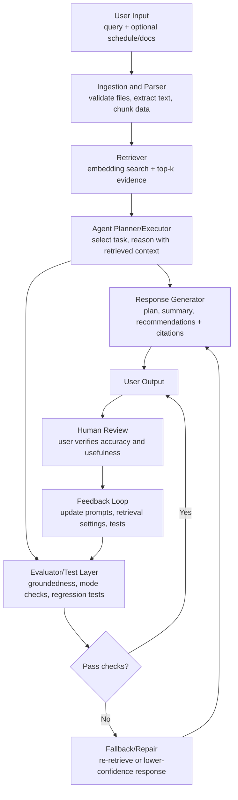

# RepoFinder / Model Docs Assistant

RepoFinder is a document intelligence assistant that uses a retrieval-augmented generation (RAG) pipeline with an agentic workflow.

It is designed to:

- Ingest local project documents.
- Retrieve relevant evidence for a user query.
- Generate grounded plans, summaries, and actionable next steps with citations.
- Evaluate response quality before returning output.
- Capture human feedback for iterative improvement.

## Why This Project Is Useful

RepoFinder helps users analyze document structure, align tasks with priorities, and recommend practical next steps.

Example use cases:

- Project planning from README + model card + notes.
- Portfolio/repository review to identify strengths, risks, and missing artifacts.
- Deadline-aware guidance from schedule documents and supporting notes.

## Core AI Features

RepoFinder integrates the following AI features in the main runtime pipeline:

1. Retrieval-Augmented Generation (RAG)
- The system retrieves top-k document chunks before generation.
- Answers are grounded in retrieved evidence and include citations.

2. Agentic Workflow
- The agent detects mode (planning/comparison/risk/summary).
- It creates a short plan, generates an answer with explicit next actions, and supports fallback repair when checks fail.

3. Reliability/Testing Layer
- The evaluator checks groundedness, mode correctness, and confidence thresholds.
- Test coverage includes end-to-end behavior and guardrail validation.

## System Diagram



## Project Structure

- `src/repofinder.py`: Core pipeline (ingestion, retriever, agent, evaluator, fallback, feedback).
- `src/repofinder_main.py`: CLI entrypoint for end-to-end runs.
- `tests/test_repofinder.py`: RepoFinder tests.
- `model_card.md`: Model card, risks, and operational requirements.

Legacy files from the earlier music recommender prototype still exist in this repository, but RepoFinder is the primary documented system.

## Setup

1. Create a virtual environment (recommended):

```bash
python -m venv .venv
```

2. Activate the environment:

On Mac/Linux:

```bash
source .venv/bin/activate
```

On Windows (PowerShell):

```powershell
.venv\Scripts\Activate.ps1
```

3. Install dependencies:

```bash
pip install -r requirements.txt
```

## Run RepoFinder

Basic run:

```bash
python -m src.repofinder_main "Plan the highest-priority tasks for this project" README.md model_card.md
```

Run with human feedback note:

```bash
python -m src.repofinder_main "What should I do this week before the deadline?" README.md model_card.md --feedback "Useful, but add more schedule detail"
```

## Run Streamlit UI

Launch the web app:

```bash
streamlit run src/streamlit_app.py
```

Then open the local URL shown in your terminal (usually `http://localhost:8501`).

### UI Workflow

1. Enter a query in the text box.
2. Upload one or more `.md`, `.txt`, `.csv`, or `.pdf` files.
3. Optionally keep `README.md` and `model_card.md` enabled from the sidebar defaults.
4. Click **Run RepoFinder**.
5. Review answer, plan, citations, confidence, and evaluation checks.

### Suggested Demo Inputs (for presentations)

- Planning case: `Plan the highest-priority tasks for this project`
- Deadline case: `What should I do this week before the deadline?`
- Guardrail case: `Explain marine biology taxonomy in coral ecosystems`

The third case demonstrates low-relevance behavior and evaluation signals.

## Output Format

The CLI returns JSON with:

- `answer`: grounded response text.
- `plan`: internal high-level action plan.
- `answer` includes a `Next Actions` section with concrete steps.
- `citations`: source chunk IDs.
- `confidence`: numeric confidence score.
- `evaluation`: pass/fail checks and notes.
- `retrieval_scores`: top retrieval similarity scores.

## Testing

Run all tests:

```bash
pytest
```

Run RepoFinder tests only:

```bash
pytest tests/test_repofinder.py
```

Current RepoFinder tests validate:

- Unsupported file-type guardrail behavior.
- PDF ingestion support.
- End-to-end grounded output with citations.
- Safe handling for low-relevance queries.

## Reproducibility and Guardrails

RepoFinder includes:

- Deterministic retrieval configuration (`chunk_size`, `overlap`, `top_k`).
- File validation (supported types, max file size, empty-file handling).
- Structured logging for ingestion, retrieval, evaluation, and feedback storage.
- Fallback repair path when initial evaluation fails.

## Known Limitations

- Current retriever is lightweight TF-IDF (no external vector database yet).
- Mode detection is rule-based and may miss ambiguous intent.
- Planner quality depends on document quality and query specificity.

## Next Steps

- Add schedule/date parsing for stronger deadline-aware planning.
- Add reranking and richer citation formatting.
- Add UI layer (Streamlit) for multi-file upload and interactive querying.
