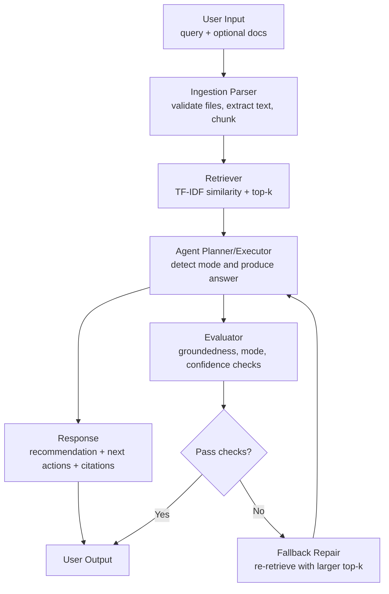

# RepoFinder: RAG Document Assistant for Project Planning

## Author

Tran Ngoc Nhat Minh

## Portfolio Artifact

- GitHub repository: add your public repo URL here
- Loom walkthrough: add your Loom URL here

## Original Project (Modules 1-3)

Original project name: Project 3 - Music Recommender Systems.

The original project goal was to recommend songs based on user preferences like genre, mood, and energy level. It focused on ranking results and explaining why a song matched a profile. That baseline gave me a working recommendation pipeline, which I later adapted into a retrieval-based assistant for project documents.

## Title and Summary

RepoFinder is a local document intelligence assistant that ingests project files and returns grounded, actionable responses with citations. It uses a lightweight RAG workflow plus an agent-style planner to organize next steps from evidence, not from free-form guessing. This matters because teams and students often have scattered notes and deadlines, and need clear action plans from the actual documents they already have.

## Architecture Overview



Short explanation: RepoFinder validates and chunks files first, retrieves top-k relevant evidence, then generates an answer with a Next Actions section. The evaluator checks quality signals before returning output, and a fallback path retries retrieval when the first pass fails checks.

## Project Structure

- src/repofinder.py: Core pipeline (ingestion, retrieval, planner, evaluator, fallback)
- src/repofinder_main.py: CLI entrypoint
- src/streamlit_app.py: Streamlit UI for uploads and interactive runs
- tests/test_repofinder.py: RepoFinder tests
- tests/test_recommender.py: Legacy recommender tests from original project
- model_card.md: Model details, risks, and deployment notes

## Setup Instructions

1. Clone the repository and move into the project directory.
2. Create a virtual environment.

```bash
python -m venv .venv
```

3. Activate the virtual environment.

Windows PowerShell:

```powershell
.venv\Scripts\Activate.ps1
```

Mac/Linux:

```bash
source .venv/bin/activate
```

4. Install dependencies.

```bash
pip install -r requirements.txt
```

5. Run tests.

```bash
pytest
```

## Run the App

### Option A: CLI

```bash
python -m src.repofinder_main "Plan the highest-priority tasks for this project" README.md model_card.md
```

Supports input files: .md, .txt, .csv, .pdf

### Option B: Streamlit UI

```bash
streamlit run src/streamlit_app.py
```

Then open the local URL shown in terminal (usually http://localhost:8501), upload files, enter a query, and click Run RepoFinder.

## Sample Interactions

Example 1

- Input:

```bash
python -m src.repofinder_main "Plan the highest-priority tasks for this project" README.md model_card.md
```

- Result highlights:
- Mode: planning
- Next action: prioritize the next actionable milestone from README.md
- Confidence: 0.538
- Evaluation passed: true
- First citation: README.md#0

Example 2

- Input:

```bash
python -m src.repofinder_main "What should I do this week before the deadline?" README.md model_card.md
```

- Result highlights:
- Mode: planning
- Next action: prioritize the next actionable milestone from README.md
- Confidence: 0.527
- Evaluation passed: true
- First citation: README.md#0

Example 3

- Input:

```bash
python -m src.repofinder_main "Explain marine biology taxonomy in coral ecosystems" README.md model_card.md
```

- Result highlights:
- Mode: summary
- Next action: system returns generic action guidance based on available evidence
- Confidence: 0.511
- Evaluation passed: true
- First citation: model_card.md#12

## Design Decisions and Trade-Offs

- Chose TF-IDF retrieval instead of external vector DB to keep setup simple and fully local.
- Added evaluator checks (groundedness, mode, confidence) to reduce ungrounded responses.
- Added fallback retrieval with higher top-k to improve reliability when first pass is weak.
- Added Streamlit for usability so non-technical users can run the system without CLI.
- Trade-off: lightweight retrieval is easy to run but less semantically rich than embedding-based search.

## Testing Summary

- Current status: 13 tests passing.
- What worked: ingestion guardrails, end-to-end planning output, low-relevance query handling, PDF ingestion support, and actionable output formatting.
- What did not work initially: import-path collection issues and weakly actionable recommendations.
- What I changed: fixed package/test collection setup, added Next Actions generation, and added PDF support.
- Key learning: reliability improves when evaluation and testing are designed as first-class features, not afterthoughts.

## Reflection

This project changed how I think about AI engineering. I learned that building a useful system is not just about generating answers, but about grounding outputs in evidence, adding guardrails, and validating behavior with tests. Through this process, I became more aware of technical debt and reasoning gaps in early designs, and I improved by turning those weaknesses into concrete fixes such as better evaluation checks, actionable outputs, and more reliable file support.
