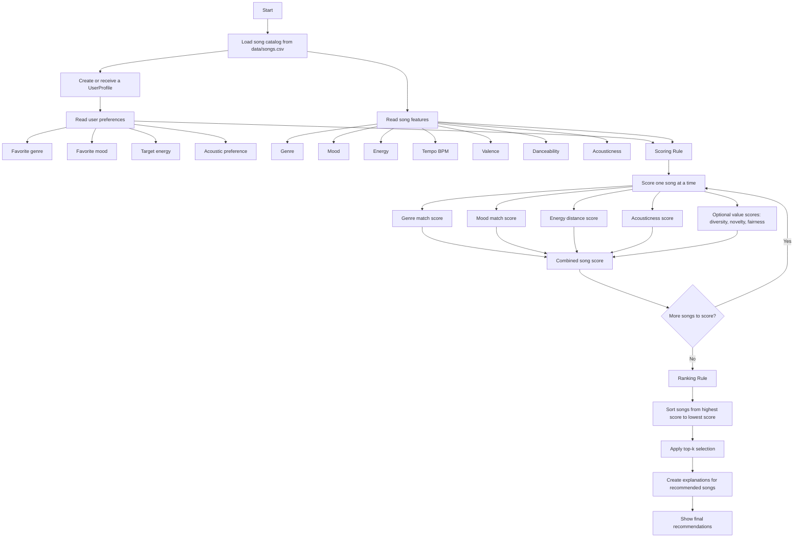

# Music Recommender Simulation

## Project Summary

This project builds a simple music recommender system using a CSV song catalog.
The catalog is stored in [data/songs.csv](data/songs.csv), which contains song
metadata such as title, artist, genre, mood, energy, tempo, valence,
danceability, and acousticness. The project does not store the actual music
files.

The `load_songs` function in [src/recommender.py](src/recommender.py) reads the
CSV file and converts each row into a dictionary or `Song` object. The
recommender then compares each song's features with a user's profile and uses a
scoring rule to decide which songs should be recommended.

## Scoring Values

The recommender can start with a simple weighted scoring rule:

```text
score = w1 * genre_match + w2 * mood_match + w3 * energy_match + ...
```

The weights (`w1`, `w2`, `w3`, etc.) decide how important each feature is. At
first, the system can use equal weights. Later, the weights can be adjusted
through experimentation, such as testing different user profiles and checking
whether the recommendations feel relevant.

The scoring rule should also reflect the recommender's main values, not only a
single user's immediate preferences:

```text
score = relevance + diversity + novelty + fairness
```

- **Relevance** measures how well a song matches the user's preferences.
- **Diversity** helps avoid recommending songs that are too similar to each
  other.
- **Novelty** helps include songs the user may not already know.
- **Fairness** helps avoid over-recommending only certain artists, genres,
  languages, or regions.

The final score can combine these values so the recommender balances personal
fit with broader goals like variety, discovery, and fairness.

---

## How The System Works

The recommender uses content-based filtering. This means it recommends songs
based on the attributes of the songs themselves, such as genre, mood, energy,
tempo, valence, danceability, and acousticness.

This approach fits the project because the dataset has song features, but it
does not have real user listening history, likes, skips, ratings, or playlists.
Because of that, collaborative filtering is not the best choice here.

### Potential User Profiles

These profiles can be used to test the recommender logic and explanations:

1. **Energetic Pop Listener**  
   Likes pop or v-pop, happy moods, high energy, and high danceability.

2. **Sad Acoustic Listener**  
   Likes calm songs, sad or heartbroken moods, low energy, and high acousticness.

3. **Dance / Party Listener**  
   Cares more about danceability, tempo, and valence than genre.

4. **Chill Study Listener**  
   Prefers relaxed or focused moods, medium-low energy, and lower tempo.

5. **Latin Dance Listener**  
   Likes reggaeton, salsa, bachata, or Latin pop with high danceability.

6. **Vietnamese Ballad Listener**  
   Likes v-pop, romantic or melancholy moods, and medium-low energy.

7. **Discovery Listener**  
   Wants variety across genres, artists, and languages instead of only close
   matches.

### Song Features

The dataset uses these features:

- **Genre**: a category such as pop, rock, jazz, v-pop, reggaeton, salsa, hip hop,
  country, reggae, or folk.
- **Mood**: the emotional feeling of the song, such as happy, sad, romantic,
  melancholy, intense, relaxed, or empowering.
- **Energy**: a value from `0.0` to `1.0`, where lower values are calmer and
  higher values are more energetic.
- **Tempo**: the speed of the song in BPM.
- **Valence**: a value from `0.0` to `1.0`, where lower values feel sadder or
  darker and higher values feel happier or more positive.
- **Danceability**: a value from `0.0` to `1.0`, where higher values mean the
  song is easier to dance to.
- **Acousticness**: a value from `0.0` to `1.0`, where higher values mean the
  song sounds more acoustic or organic.

Genre and mood are categorical labels. In a more advanced system, these labels
could be predicted from lyrics, audio, or metadata using machine learning
models. For this project, the labels are already included in the dataset, so the
recommender can use them directly.

### Algorithm Choice

This project uses a **content-based filtering** approach.

Other possible approaches include:

- **Collaborative filtering**: recommends songs based on what similar users
  liked. This requires user interaction data, which this project does not have.
- **Hybrid recommendation**: combines content-based and collaborative filtering.
  This can be stronger in real systems, but it requires more data.

Since this project only has song metadata and a user profile, content-based
filtering is the best fit.

### Recommendation Recipe

1. Define a scoring function that takes one song and one user profile.
2. Compare the song's features with the user's preferences.
3. Use weighted scores for genre, mood, energy, acousticness, and other features.
4. Generate a short explanation for each song.
5. Sort all songs by score.
6. Return the top `k` recommendations.

The explanation can describe which features contributed most to the score. For
example: "This song matches your preferred mood and has an energy level close to
your target."

Potential issues: genre could be over-focused on genre or mood --> The word relationship (BERT) should be marginalized (there are a lot of genres like BERT) --> Your algorithms should be visualized to accept hundreds of different genres and different vector embeddings --> The totals could be vector differences.

### Process Diagram



The **Scoring Rule** evaluates one song at a time. The **Ranking Rule** takes
all scored songs, sorts them, and returns the best `k` recommendations.

---

## Getting Started

### Setup

1. Create a virtual environment. This is optional, but recommended.

   ```bash
   python -m venv .venv
   ```

2. Activate the virtual environment.

   On Mac or Linux:

   ```bash
   source .venv/bin/activate
   ```

   On Windows:

   ```bash
   .venv\Scripts\activate
   ```

3. Install dependencies.

   ```bash
   pip install -r requirements.txt
   ```

4. Run the app.

   ```bash
   python -m src.main
   ```

### Running Tests

Run the starter tests with:

```bash
pytest
```

You can add more tests in `tests/test_recommender.py`.

---

## Experiments To Try

Use this section to document experiments with the recommender. For example:

- What happens when the weight on genre changes from `2.0` to `0.5`?
- What happens when tempo or valence is added to the score?
- How does the system behave for different user profiles?
- Does the recommender over-favor one genre, artist, mood, language, or region?
- Do the explanations match the songs that were recommended?

---

## Limitations and Risks

This recommender is useful for classroom exploration, but it has important
limitations:

- It uses manually assigned song metadata rather than full audio analysis.
- It does not understand lyrics, cultural meaning, or personal context.
- It does not use real listening history, skips, likes, or ratings.
- It may over-favor genres, moods, or languages that appear more often in the
  dataset.
- It may treat a user's taste as too simple, even though real people often enjoy
  different music in different situations.
- It may recommend popular or familiar music more often than lesser-known songs
  unless diversity and novelty are included in the ranking rule.

These limitations should also be discussed in [model_card.md](model_card.md).

---

## Reflection

This project shows how recommender systems turn data into predictions. Even a
simple system has to make choices about what matters: genre, mood, energy,
danceability, acousticness, diversity, novelty, and fairness.

It also shows where bias can appear. If the dataset includes more songs from one
language, genre, region, or artist group, the recommender may favor those songs.
Human judgment still matters because music taste is personal, cultural, and
context-dependent. A score can help organize choices, but it cannot fully
understand why a song matters to someone.

For a fuller explanation of the model's intended use, strengths, limitations,
and evaluation, see [model_card.md](model_card.md).
