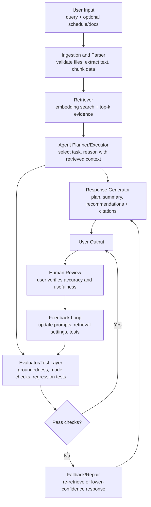

# Model Card: RepoFinder / Model Docs

## 1. Model Name

RepoFinder (Model Docs Assistant) v1.0

## 2. Model Type and Architecture

This project uses a retrieval-augmented generation (RAG) pipeline with an agentic workflow.

- Base model: general-purpose LLM (inference-time reasoning, no custom pretraining).
- Retrieval layer: document chunking + embeddings + vector search over repository and planning documents.
- Agent layer: planner/executor pattern that can decide when to retrieve, summarize, compare priorities, and produce an action plan.
- Output layer: structured responses for roadmap, risks, and next-step recommendations.

The system is optimized for planning and decision support and is not intended for autonomous execution of high-risk actions.

### System Diagram (RepoFinder)

Data flow summary: input documents and queries are parsed, retrieved, reasoned over by the agent, and then evaluated before final output. Human review and test results feed improvements back into retrieval, prompting, and evaluation settings.

## 3. Intended Use

RepoFinder is intended to analyze document structure, align tasks with priorities, and recommend next steps for technical projects.

It is designed to help users:

- Analyze many repositories or mixed file collections at scale.
- Organize and prioritize tasks within a repository.
- Review project portfolios to identify patterns, strengths, risks, and missing artifacts.

Out of scope:

- Legal, immigration, or hiring guarantees.
- Final admissions or recruiting decisions.
- Unverified claims about program outcomes.

## 4. Training and Adaptation Strategy

The current version does not use full model fine-tuning. It uses retrieval and prompt-level adaptation.

Adaptation stages:

1. Retrieval tuning (first priority):
  Adjust chunk size, overlap, metadata tags, and reranking to improve grounded answers.
2. Prompt and agent policy tuning:
  Add explicit role instructions per application mode, tool-routing rules, and refusal/safety boundaries.
3. Evaluation-driven iteration:
  Improve with failed examples from offline eval sets and user feedback.
4. Optional lightweight supervised fine-tuning later:
  Only after collecting enough high-quality prompt-answer pairs for each mode.

## 5. Data

Recommended corpus categories for this project:

- Repository docs: README, model card, architecture docs, issues, milestones.
- Program-facing docs: application prompts, rubric notes, timeline constraints, and personal reflections.
- Evidence artifacts: demo scripts, benchmark tables, screenshots, and experiment logs.

Data quality requirements:

- Source traceability for every chunk.
- Timestamp/version metadata.
- Removal of sensitive personal data before indexing.

## 6. Evaluation

The evaluation suite uses three slices (one per application mode):

1. Groundedness:
  Does each claim map to retrieved evidence?
2. Planning quality:
  Are milestones concrete, feasible, and priority-aware?
3. Mode correctness:
  Does output match the selected track (CodePath vs MLH vs Builder Residency)?
4. Safety and integrity:
  Avoid fabricated requirements, unsupported claims, and overconfident guidance.

Suggested metrics:

- Citation hit rate.
- Hallucination rate.
- Plan completeness score.
- Human rubric score (clarity, usefulness, credibility).

## 7. Strengths

- Strong at turning scattered docs into structured plans.
- Clear reasoning trace when citations are enabled.
- Flexible across education, fellowship, and residency positioning.
- Agentic workflow supports multi-step analysis instead of single-shot answers.

## 8. Limitations and Risks

- Quality depends on retrieval quality; missing documents lead to weak plans.
- Program information can become outdated over time.
- Agent loops can over-iterate without hard stopping rules.
- Domain drift risk when the user asks beyond indexed evidence.

Mitigations:

- Require source-backed claims.
- Add confidence labels for uncertain recommendations.
- Enforce freshness checks and metadata-aware retrieval.
- Cap planning iterations and require explicit completion criteria.

## 9. Responsible Use

- Always verify deadlines and eligibility directly from official sources.
- Treat generated plans as advisory, not authoritative.
- Do not fabricate achievements, metrics, or affiliations.
- Keep private application materials secure and minimally retained.

## 10. Reproducibility, Guardrails, and Operations

Reproducibility requirements:

- Deterministic configuration for retrieval parameters (chunk size, overlap, top-k).
- Pinned dependencies in requirements file.
- Documented environment variables in an example env file.
- Single-command local run path and single-command test path.

Logging and guardrails:

- Structured logs for ingestion, retrieval hits, selected context, and final decision path.
- Input validation for file type, size limits, and empty/corrupted files.
- Safe failure behavior when retrieval returns low-confidence or no relevant context.
- Redaction path for sensitive content before indexing.

Minimum acceptance checks before submission:

1. Fresh clone setup succeeds from README instructions.
2. End-to-end RAG query returns answer with source citations.
3. Agent mode produces a step-by-step prioritized plan from schedule input.
4. Test suite passes for at least one scenario in each application track.
5. Error path is user-friendly for invalid input or missing data.

## 11. Versioning and Change Log

- v1.0 (2026-04-21): Reframed from music recommendation template to RepoFinder RAG + agentic planning model card with three application tracks.
- v1.1 (2026-04-23): Added explicit rubric alignment, integrated pipeline proof, and reproducibility/guardrail requirements for DocuBot-style evaluation.
- v1.2 (2026-04-26): Polished language for consistency and clarity in intended use, evaluation, and operational wording.
